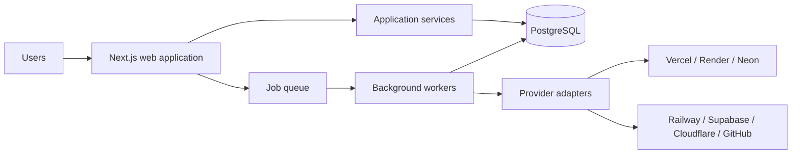
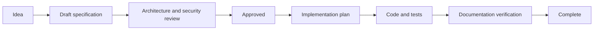

# Harbor documentation

Status: Active  
Audience: Product, engineering, security, operations, and AI coding agents

## Vision

Harbor is a unified control plane for modern cloud applications. It gives teams
one consistent view of applications, deployments, databases, environments,
infrastructure, and operational events across Vercel, Render, Neon, Railway,
Supabase, Cloudflare, and GitHub.

Harbor should reduce provider-specific operational friction without hiding the
capabilities or source of truth of each provider.

## Goals

- Provide a secure, organization-scoped inventory of cloud resources.
- Normalize common concepts while preserving provider-specific detail.
- Make synchronization observable, resumable, and safe.
- Give users consistent workflows for applications, environments, deployments,
  configuration, audit history, and notifications.
- Support incremental provider adoption and feature delivery.
- Maintain specifications, decisions, tests, and operations guidance as one
  coherent system.
- Make bounded, phase-by-phase implementation practical for humans and AI
  assistants.

## Non-goals

- Replacing provider consoles or becoming a cloud provider.
- Hiding all provider differences behind a lowest-common-denominator model.
- Provisioning or mutating provider resources before read-only synchronization
  is reliable and authorized.
- Building a generic workflow engine, secret manager, billing platform, or
  observability backend in the initial product.
- Supporting every provider or resource type at launch.
- Creating abstractions without a documented current use.

## Technology stack

- Next.js App Router and React Server Components
- TypeScript with strict checking
- Tailwind CSS and shadcn/ui
- Drizzle ORM and PostgreSQL on Neon
- Better Auth
- Zod, React Hook Form, and TanStack Query
- pnpm, ESLint, Prettier, Husky, and lint-staged

Versions are pinned by the repository. Version upgrades require compatibility
review, updated documentation, and normal verification.

## Architecture overview

Harbor is a modular monolith with feature-owned application modules, a shared
PostgreSQL system of record, and explicit adapters at external boundaries.
Next.js hosts the web interface and server entry points. Background workers
perform durable provider synchronization. Provider-native identifiers and raw
metadata remain traceable alongside Harbor's normalized resource model.

Detailed views:

- [System architecture](architecture/system-overview.md)
- [Data architecture](architecture/database.md)
- [Provider architecture](architecture/providers.md)
- [Synchronization architecture](architecture/synchronization.md)
- [Security architecture](architecture/authentication.md)

## Development principles

1. Documentation first: approved specifications precede implementation.
2. Incremental delivery: every phase produces a usable, verifiable outcome.
3. Feature isolation: domain behavior belongs to the owning feature.
4. Production quality: security, observability, migrations, tests, and recovery
   are design inputs.
5. Simplicity: choose the smallest design that satisfies current requirements.
6. Explicitness: prefer visible contracts and ownership over convention magic.
7. Testability: boundaries, side effects, and acceptance criteria are defined.
8. Traceability: code, migrations, APIs, tests, ADRs, and operations guidance
   link back to approved documents.

## Documentation workflow

No implementation begins until its feature specification and phase requirements
are `Approved`.

Each document uses these lifecycle states:

- `Draft`: open to structural change; implementation is blocked.
- `Review`: complete enough for stakeholder review.
- `Approved`: authoritative input to implementation.
- `Implemented`: shipped behavior matches the approved document.
- `Superseded`: retained for history and linked to its replacement.

See [Documentation workflow](guides/documentation-workflow.md) and
[Documentation standards](standards/documentation.md).

## Roadmap summary

Harbor progresses from documentation governance and a secure product foundation
through identity, tenancy, provider connectivity, synchronization, inventory,
application/deployment experiences, automation, and production hardening.

The authoritative sequence is:

1. Documentation governance and foundation
2. Authentication, organizations, authorization, and auditability
3. Provider connections and durable synchronization
4. Resource inventory and normalized application views
5. Deployments, configuration, dashboard, search, and notifications
6. API automation, operational hardening, and controlled launch

See the [complete roadmap](roadmap/README.md) and [phase index](phases/README.md).

## Documentation map

| Area                                   | Purpose                                       |
| -------------------------------------- | --------------------------------------------- |
| [Architecture](architecture/README.md) | System boundaries and quality attributes      |
| [Roadmap](roadmap/README.md)           | Outcomes, milestones, dependencies, and order |
| [Phases](phases/README.md)             | Incremental delivery gates                    |
| [Features](features/README.md)         | User and domain specifications                |
| [API](api/README.md)                   | External and internal HTTP contracts          |
| [Database](database/README.md)         | Conceptual data model and migration policy    |
| [Decisions](decisions/README.md)       | Architecture decision records                 |
| [Guides](guides/README.md)             | Repeatable project workflows                  |
| [Standards](standards/README.md)       | Required engineering practices                |
| [Prompts](prompts/README.md)           | Reusable AI task prompts                      |
| [AI skills](skills/README.md)          | Context packs agents load before work         |

## Ownership model

Ownership is role-based until named maintainers are recorded in repository
settings. Product owns roadmap, phase, and feature intent. Engineering owns
architecture, API, database, implementation guides, and code-linked accuracy.
Security owns security requirements and threat decisions. Operations owns
deployment, telemetry, recovery, and incident guidance. Changes spanning areas
require every affected owner role to review them.

Area indexes are the navigation owners for their children: each new
authoritative document must be linked from its nearest index, and each planned
feature must be mapped in `features/README.md` to a delivery phase.

## Change rule

When implementation and documentation disagree, implementation is considered
incorrect unless an approved ADR explicitly changes the documented contract.
