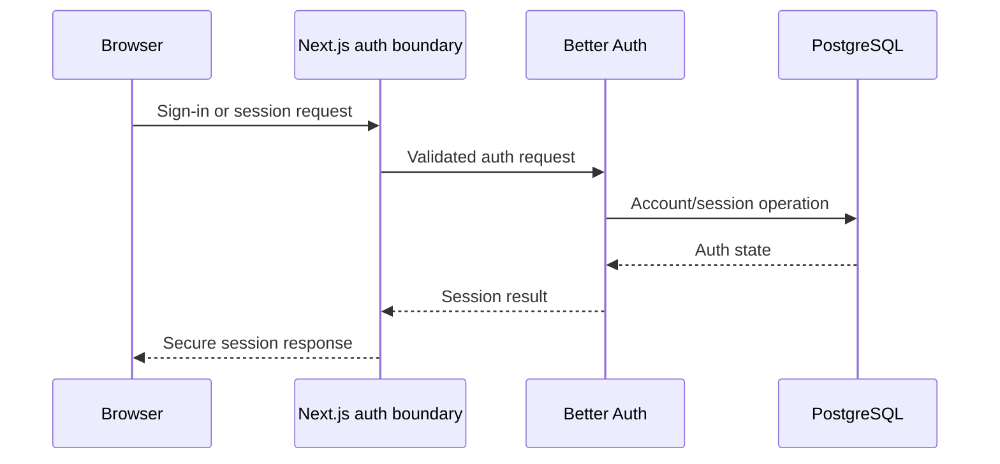

# Authentication architecture

Status: Draft

## Boundary

Better Auth owns user authentication, accounts, sessions, and verification
artifacts through its Drizzle adapter. Harbor owns organization membership,
authorization, audit policy, and product profile data.

Authentication proves an actor identity. It never proves organization access.

## Flow

## Policies

- Auth routes are rate-limited and protected against enumeration and open
  redirects.
- Session cookies are secure, HTTP-only, appropriately same-site, and narrowly
  scoped.
- Verification and recovery artifacts are one-time, short-lived, and
  non-disclosing.
- Session revocation, expiry, credential change, and suspected compromise have
  documented behavior.
- Provider OAuth tokens, if later added, are distinct from Harbor cloud
  provider connection credentials.
- Auth tables remain compatible with the pinned Better Auth version; schema
  changes are generated and reviewed.

## Trust boundaries

Only server code resolves authoritative sessions. Client session data is display
state. Sensitive operations may require recent authentication according to
feature threat models.

## Audit and privacy

Record security-relevant outcomes without password, token, secret, or excessive
personal data. Retention and user deletion behavior follow the data lifecycle
policy.
