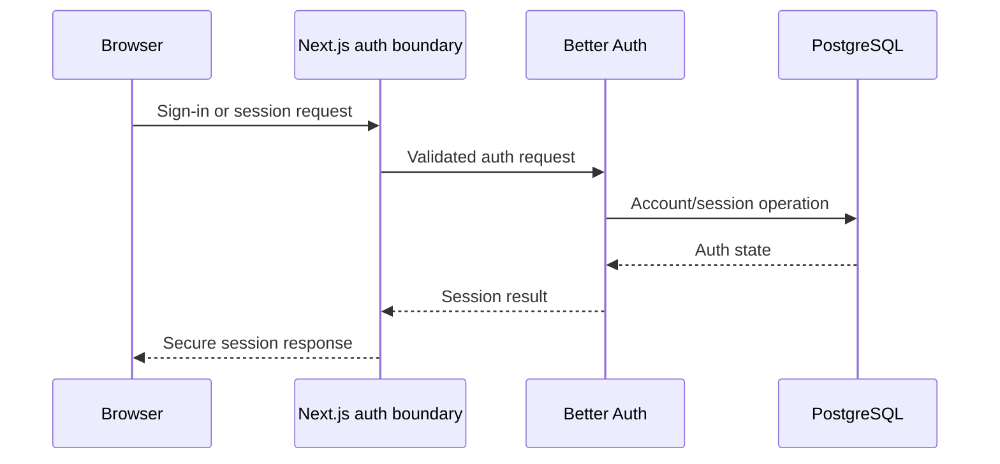

# Authentication architecture

Status: Review

## Boundary

Better Auth owns user authentication, accounts, sessions, and verification
artifacts through its Drizzle adapter. Harbor owns organization membership,
authorization, audit policy, and product profile data.

Authentication proves an actor identity. It never proves organization access.

## Flow

## Policies

- Auth routes are rate-limited and protected against enumeration and open
  redirects.
- Session cookies are secure, HTTP-only, appropriately same-site, and narrowly
  scoped.
- Verification links are short-lived and idempotent after success. Recovery
  artifacts are short-lived, single-use, and non-disclosing.
- Session revocation, expiry, credential change, and suspected compromise have
  documented behavior.
- Provider OAuth tokens, if later added, are distinct from Harbor cloud
  provider connection credentials.
- Auth tables remain compatible with the pinned Better Auth version; schema
  changes are generated and reviewed.

## Trust boundaries

Only server code resolves authoritative sessions. Client session data is display
state. Sensitive operations may require recent authentication according to
feature threat models.

## Audit and privacy

Record security-relevant outcomes without password, token, secret, or excessive
personal data. Retention and user deletion behavior follow the data lifecycle
policy.

## Initial session policy

Email/password is the only enabled identity method. Passwords are 12–128
characters and remain Better Auth-hashed. Database sessions expire after seven
days, refresh at most once per day, and have a ten-minute freshness window.
Account linking is disabled. Only server components and route handlers make
authoritative session decisions; client session state is never an authorization
boundary.

## Operational controls

Resend delivers verification and recovery email from a configured sender.
Upstash Redis stores shared rate-limit counters and Better Auth's ephemeral
cache. Session and verification records are also retained in PostgreSQL, and
single-use recovery challenges are consumed transactionally there. Harbor emits
allowlisted structured authentication outcomes without identity or credential
material. Live provider checks remain required before production certification.
