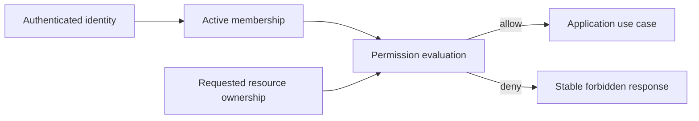

# Authorization architecture

Status: Draft

## Model

Harbor uses organization-scoped role-based access control initially. Roles map
to explicit permissions; application services evaluate permissions against the
authenticated actor, organization, action, and optional resource.

Initial roles:

- Owner: organization lifecycle, ownership, and all administrative permissions.
- Admin: operational and membership administration except protected ownership
  actions.
- Member: routine resource and application operations permitted by policy.
- Viewer: read-only access to permitted organization data.

The exact matrix lives in the authorization feature specification.

## Enforcement

- Entry points validate organization identifiers but application services
  enforce authorization.
- Resource ownership is loaded or constrained by organization; caller-supplied
  ownership is not trusted.
- Unknown role, missing membership, suspended membership, or ambiguous ownership
  denies access.
- UI capability hints improve experience but have no security authority.
- Jobs carry actor and organization context for audit, then revalidate current
  authority before sensitive delayed execution.

## Evolution

Custom roles, resource-level grants, service accounts, and policy engines are
out of scope until documented use cases exceed the initial matrix. Permission
names should remain stable even if role composition evolves.
