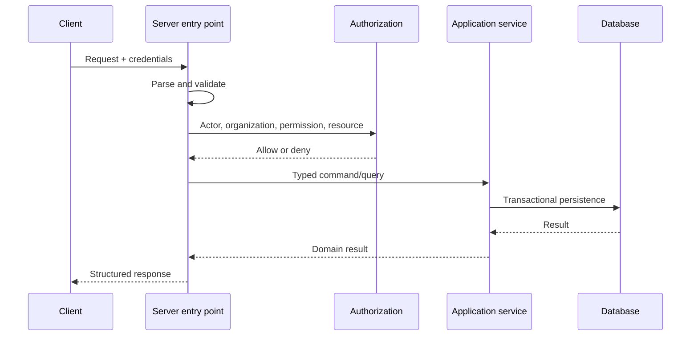

# Backend architecture

Status: Draft

## Responsibilities

The backend authenticates requests, resolves tenant context, authorizes actions,
validates input, orchestrates domain behavior, persists state, schedules durable
work, and emits structured audit and telemetry signals.

## Request flow

## Layers

- Entry points: Next.js Route Handlers and narrowly scoped Server Actions.
- Application services: use-case orchestration and transaction intent.
- Domain policy: invariants, permission vocabulary, state transitions.
- Persistence: feature-owned Drizzle queries and mappings.
- Integration: provider, queue, email, encryption, and clock adapters.

Dependencies point inward. Domain and application layers do not import UI or
concrete provider adapters.

## Transaction and event policy

Operations that must change together use one database transaction. Jobs are
enqueued through a durable post-commit or outbox strategy when losing the job
would violate the use case. Audit events are written with the protected state
change when practical.

## Failure policy

Expected failures use stable typed error categories. Unknown failures are
captured with a correlation identifier and return no internal detail. External
calls always have timeouts; retries occur only for classified transient,
idempotent operations.

## Runtime constraints

Server-only modules must not enter client dependency graphs. Provider SDKs and
credentials are isolated to integration boundaries. Long-running and retried
work executes in workers, not request lifetimes.
