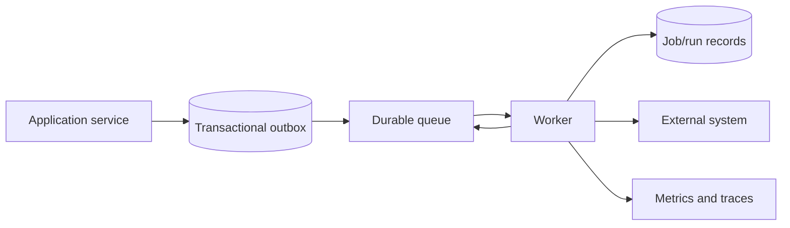

# Background jobs architecture

Status: Draft

## Responsibilities

Execute sync, notification fan-out, cleanup, export, and other approved work
outside request lifetimes with durable status and bounded recovery.

## Components

The exact queue product is deferred until Phase 06 and recorded by ADR.

## Job envelope

Every job declares type, schema version, stable identifier, organization,
correlation, creation time, attempt, maximum age, idempotency key, and a minimal
payload containing identifiers rather than secrets or large snapshots.

## Execution rules

- Assume duplicate and delayed delivery.
- Validate payload version before work.
- Re-load authoritative state and permission-relevant status.
- Acquire domain-specific leases where concurrency is unsafe.
- Use timeouts and heartbeats for bounded work.
- Checkpoint only after durable progress.
- Classify failures before retry; never retry validation or revoked-credential
  failures indefinitely.
- Move exhausted work to an inspectable terminal state.

## Operations

Operators can search by job/run/correlation/organization, see redacted failure
context, retry approved failures, cancel eligible work, and identify poison
messages. Every manual intervention is authorized and audited.
