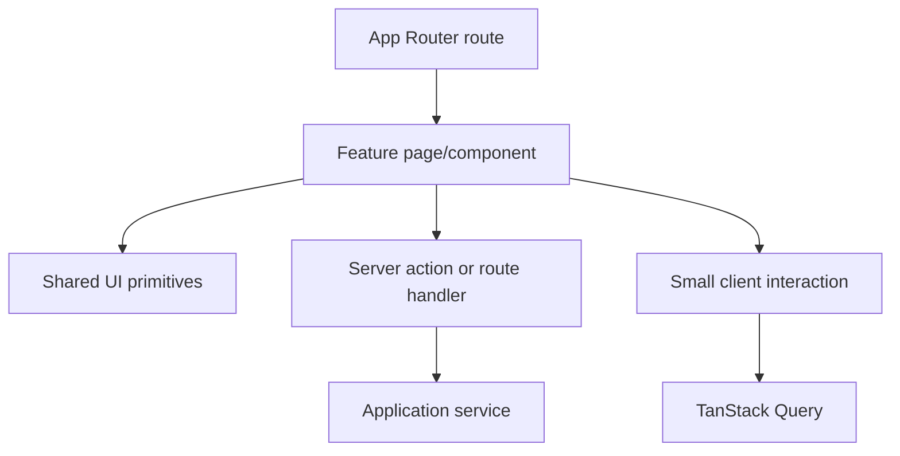

# Frontend architecture

Status: Draft

## Responsibilities

Present organization-scoped Harbor state, collect validated user intent, expose
loading/empty/stale/error states, and provide accessible navigation. The
frontend is not an authorization boundary or source of business truth.

## Rendering model

- Server Components are the default for pages, layouts, and read-heavy views.
- Client Components are narrow interactive islands for forms, local UI state,
  browser APIs, and TanStack Query consumers.
- URL state represents shareable filters, pagination cursors, and selected tabs.
- Server-fetched data is preferred for initial render; client queries are used
  for polling, optimistic interaction, or highly interactive views.
- Authenticated tenant data is never assumed safe to cache across users or
  organizations.

## Structure

Feature-specific components remain within `src/features/<feature>`. Reusable,
domain-neutral components live in `src/components`. Route files compose
features and metadata; they do not contain business logic.

## State ownership

- Server/domain state: database and application services.
- URL state: navigation and shareable view configuration.
- Query state: remote server state needed on the client.
- Form state: React Hook Form with Zod-aligned validation.
- Ephemeral UI state: local component state.

Global client state requires an approved current need.

## UI contract

Every data surface specifies loading, empty, stale, partial, error, forbidden,
and not-found states. Destructive actions require explicit impact, confirmation
where appropriate, pending state, idempotent submission, and recoverable error
feedback.

## Accessibility and performance

- Target WCAG 2.2 AA.
- Keyboard access, focus management, semantic headings, and live-region behavior
  are acceptance requirements.
- Client bundle growth and route latency are reviewed per feature.
- Large tables use server pagination; virtualization follows measured need.
- Provider logos and colors supplement, never replace, textual meaning.
