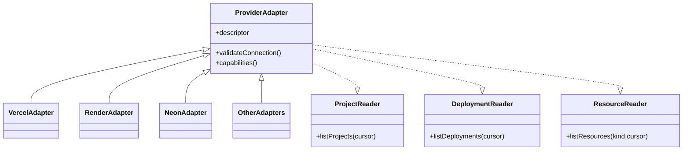

# Provider architecture

Status: Draft

## Purpose

Isolate provider-specific authentication, API semantics, pagination, rate
limits, identifiers, statuses, and capabilities from Harbor domain behavior.

## Contract model

Capabilities are explicit and composable. An adapter implements only supported
contracts. Unsupported operations return a capability result, not a fake empty
success.

## Adapter responsibilities

- Build authenticated provider requests from server-only credential access.
- Enforce timeouts, provider request identifiers, pagination, and bounded
  concurrency.
- Classify provider errors into stable categories.
- Preserve provider-native identifiers and status.
- Normalize only fields defined by the contract.
- Scrub credentials and unapproved sensitive metadata.
- Expose rate-limit observations to the sync scheduler.

Adapters do not authorize Harbor users, persist arbitrary domain records,
schedule themselves, or silently retry unbounded work.

## Certification

Each provider/resource capability requires fixtures or contract tests for
pagination, empty results, malformed data, rate limiting, auth failure,
permission gaps, deletion, duplicate responses, timeouts, and schema evolution.

## Rollout

New adapters start read-only, behind a capability flag, for internal
organizations. A provider moves to supported only after sync convergence,
operability, security scope, documentation, and provider terms are reviewed.
