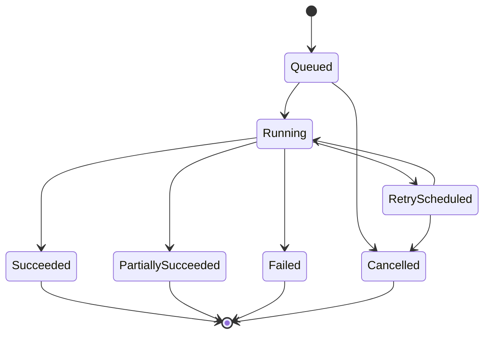

# Synchronization architecture

Status: Draft

## Objective

Converge Harbor's observed resource inventory toward provider state despite
pagination, retries, duplicate delivery, partial failure, rate limits, and
concurrent triggers.

## Model

A sync run records trigger, connection, capability, status, lease, cursor or
checkpoint, counts, timing, error summary, and correlation identifiers. Detailed
errors are bounded and redacted.

## Guarantees

- Job delivery is assumed at least once.
- Handlers are idempotent for a stable run and provider item identity.
- One active lease exists per connection/capability partition unless a
  documented provider contract permits more.
- Cursors are committed only after the corresponding page is durably processed.
- A full successful reconciliation may mark unseen resources stale or deleted;
  a partial run may not.
- Provider events can accelerate sync but do not bypass reconciliation.

## Rate limits and retries

The scheduler honors provider reset signals, applies jittered exponential
backoff, caps attempts and total age, and distinguishes credential, permission,
validation, transient, rate-limit, and provider-terminal failures.

## Observability

Measure queue delay, sync lag, duration, success ratio, retries, rate-limit
wait, pages, items observed/created/updated/staled, and error category. Alerts
target sustained inability to converge, not single transient failures.

## Recovery

Operators can inspect a run, revoke a lease, retry from a safe checkpoint,
cancel queued work, and trigger a bounded full reconciliation. Recovery actions
are authorized and audited.
