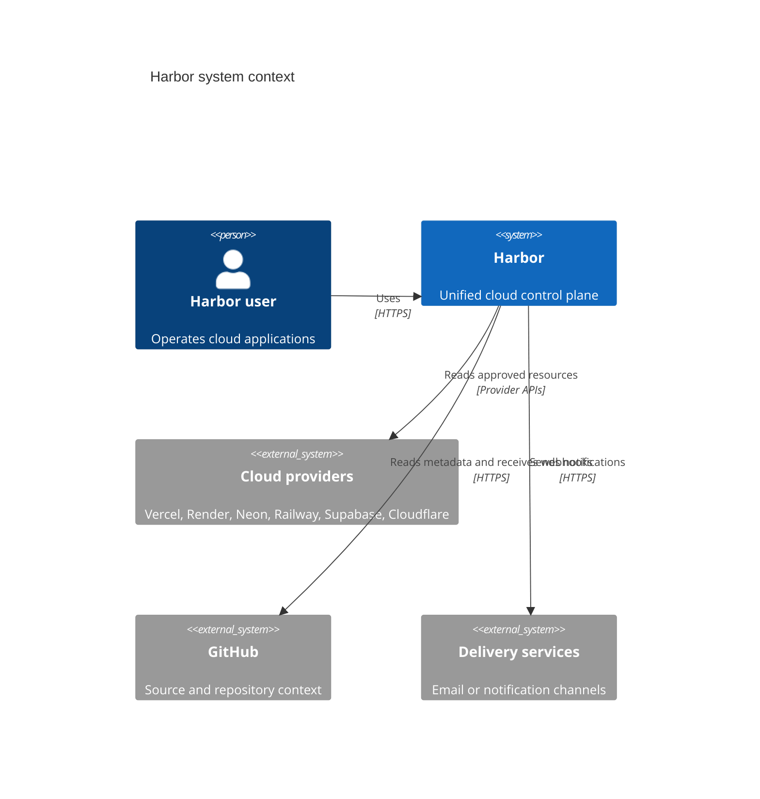
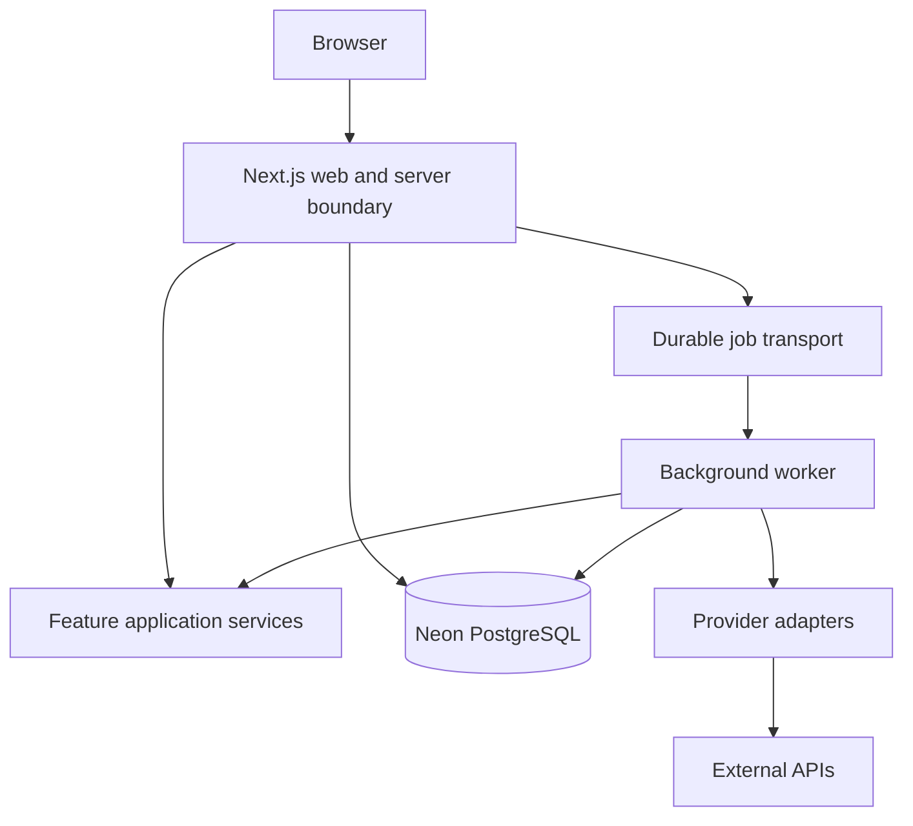

# System architecture

Status: Draft

## Architectural style

Harbor begins as a modular monolith. Feature modules own domain behavior and
compose through explicit application-service contracts. Provider adapters,
background workers, the database, and external delivery services are boundary
components, not separate domains.

This avoids distributed-system overhead while preserving seams for later
extraction when deployment, scaling, ownership, or reliability evidence demands
it.

## Context

## Containers

## Boundary rules

- UI components do not access the database or provider SDKs.
- Route handlers and server actions authenticate, authorize, validate, and then
  call application services.
- Application services own use-case orchestration and transaction boundaries.
- Feature repositories own feature persistence queries.
- Provider adapters translate provider-native data into explicit provider
  contracts; they do not make tenant authorization decisions.
- Workers execute durable commands; the queue is not a source of truth.
- PostgreSQL is authoritative for Harbor state. Providers remain authoritative
  for synchronized external resource state.

## Quality attributes

Priority order:

1. Tenant isolation and credential confidentiality
2. Correctness and recoverability
3. Auditability and traceability
4. Operability and observability
5. Maintainability and testability
6. Performance and cost efficiency
7. Provider breadth

## Evolution triggers

A module may become a separate deployable service only with measured need, a
clear data owner, independent operational ownership, defined consistency model,
and an approved ADR. Queue throughput alone does not require service extraction.
