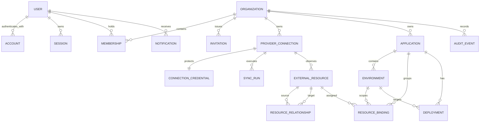

# Entity relationships

Status: Draft

## Relationship rules

- A membership references exactly one user and one organization.
- Tenant-owned children cannot reference parents from another organization.
- A connection belongs to one organization; a resource inherits that owner and
  also stores it directly where needed for safe query scoping.
- An external resource is unique by connection, provider resource kind, and
  provider-native identifier.
- A resource relationship joins resources in the same organization and normally
  the same provider connection unless a documented cross-provider link exists.
- An environment belongs to one application; both belong to the same
  organization.
- A resource binding belongs to one organization and cannot cross application,
  environment, or resource ownership.
- A deployment may retain an application/environment association after a source
  resource becomes stale.
- Audit events may reference deleted actors or targets through immutable
  identifiers and safe display snapshots.

## Cardinality review

Cardinality changes are data-model changes. They require updated feature
semantics, migration/backfill behavior, authorization impact, and an ADR when
the ownership model changes.
