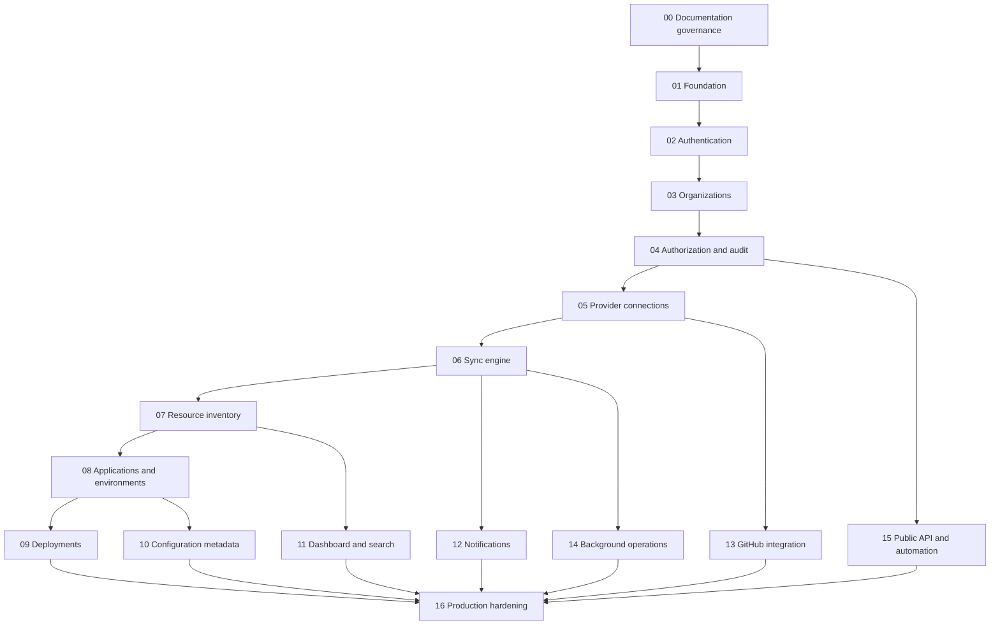

# Dependency graph

Status: Draft

## Critical path

The critical path is governance → foundation → authentication → organizations →
authorization → provider connections → synchronization → inventory →
applications → deployments → production hardening.

Dashboard polish and provider breadth must not bypass this path.

## Dependency rules

- A feature may depend on an earlier phase or stable shared primitive.
- Circular feature dependencies require redesign or an ADR.
- Optional integrations depend inward on core contracts; core domain modules do
  not import provider implementations.
- Public APIs depend on stable application services, not UI modules.
- Notifications consume domain events and never become the source of truth.
